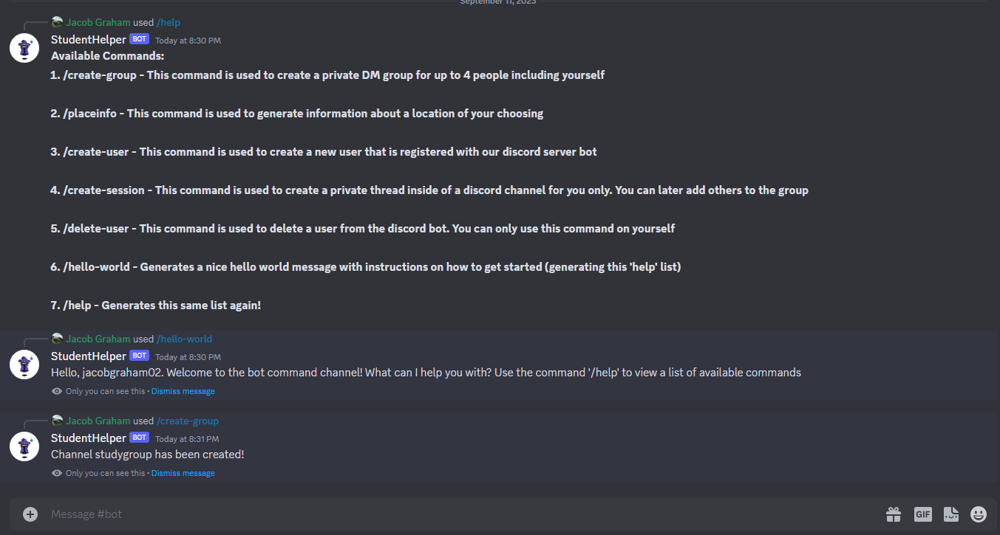
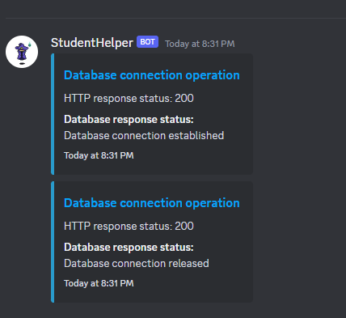

# StudentBotHelper

<!-- TABLE OF CONTENTS -->
<section>
  <article>
    <ol>
      <li>
        <a href="#about-the-project">About The Project</a>
        <ul>
          <li><a href="#built-with">Built With</a></li>
        </ul>
      </li>
      <li>
        <a href="#getting-started">Getting Started</a>
        <ul>
          <li><a href="#prerequisites">Prerequisites</a></li>
          <li><a href="#installation">Installation</a></li>
        </ul>
      </li>
      <li><a href="#usage">Usage</a></li>
      <li><a href="#roadmap">Roadmap</a></li>
      <li><a href="#contributing">Contributing</a></li>
      <li><a href="#license">License</a></li>
      <li><a href="#contact">Contact</a></li>
      <li><a href="#acknowledgments">Acknowledgments</a></li>
    </ol>
  </article>
</section>

<section>
  <!-- ABOUT THE PROJECT -->
  ## About The Project
  
  
  
  
  StudentBotHelper is a Discord bot primarily aimed at College and University students to both relieve them of menial and repetitive work (e.g. logging due dates), and to centralize a lot of resources they find useful onto one platform. In 2023, a lot of student, incuding myself, use Discord for purposes ranging from gaming to school. Therefore, a Discord bot that is aimed at assisting specifically students will garner a lot of interest and be appreciated by a large chunk of Discord users. 
  
  
(<a href="#readme-top">back to top</a>)

</section>

<section>
  ## Built with
  * [![Discord API][Discord.js]][(https://discord.js.org/)]
  * [![JavaScript][JavaScript]][https://developer.mozilla.org/en-US/docs/Web/JavaScript]
  * [![Microsoft Azure][Microsoft Azure]][https://azure.microsoft.com/en-ca]
  * [![Google Places API][Google Places API]][https://developers.google.com/maps/documentation/places/web-service/overview]
  * [![Google Directions API][Google Directions API]][https://developers.google.com/maps/documentation/directions/overview]
  * [![TypeScript][Typescript]][(https://www.typescriptlang.org/)]
</section>

