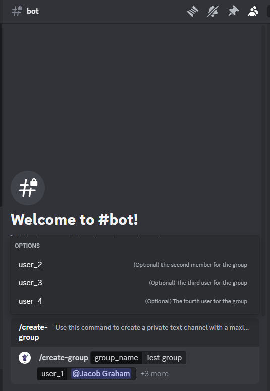
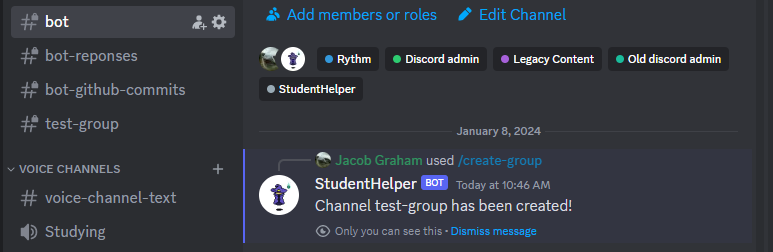
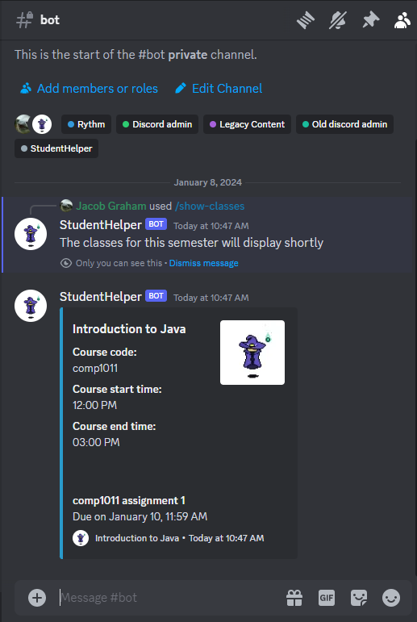
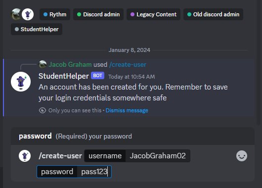
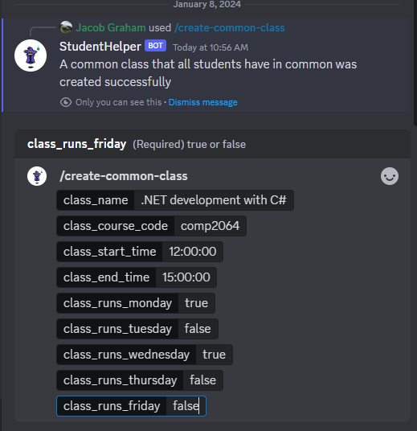
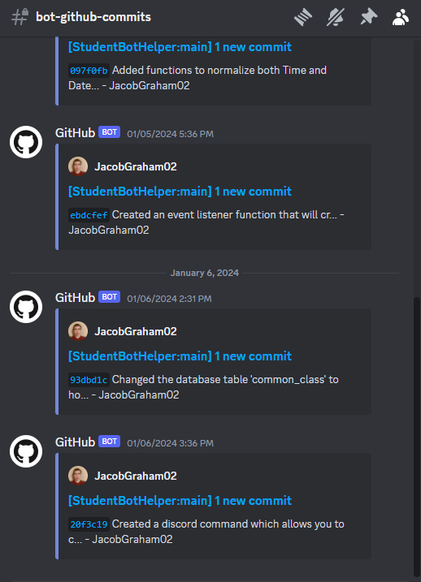
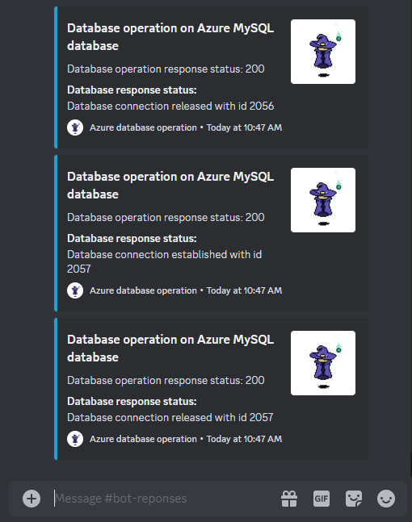
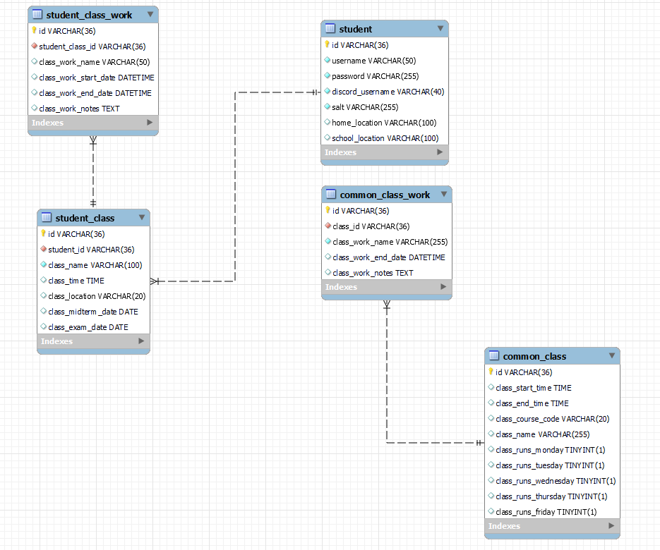

# StudentBotHelper

<!-- TABLE OF CONTENTS -->
<section>
  <article>
    <ol>
     <li><a href="#about-the-project">About The Project</a></li>
     <li><a href="#purpose-of-project">Project purpose</a></li>
     <li><a href="#built-with">Built With</a></li>
     <li>
        <a href="#getting-started">Getting Started</a>
        <ul>
          <li><a href="#prerequisites">Prerequisites</a></li>
          <ul>
            <li><a href="#if-on-windows">If on Windows</a></li>
            <li><a href="#if-on-macos">If on MacOS</a></li>
            <li><a href="#if-on-linux">If on Linux</a></li>
          </ul>
          <li><a href="#installation">Installation</a></li>
        </ul>
     </li>
     <li><a href="#usage">Usage</a></li>
     <li><a href="#contributing">Contributing</a></li>
     <li><a href="#contact">Contact me</a></li>
    </ol>
  </article>
</section>

<section>
  <article>
    <!-- ABOUT THE PROJECT -->
    <h2 id="about-the-project">About The Project</h2>
    
  </article>
  
  
  
  
  
  
  
  
  
  
  
  StudentBotHelper is a Discord bot primarily aimed at College and University students to both relieve them of menial and repetitive work (e.g. logging due dates), and to centralize a lot of resources they find useful onto one platform. In 2023, a lot of student, incuding myself, use Discord for purposes ranging from gaming to school. Therefore, a Discord bot that is aimed at assisting specifically students will garner a lot of interest and be appreciated by a large chunk of Discord users. 
  
</section>

<section>
  <!-- The purpose of the project -->
  <h2 id="purpose-of-project">About The Project</h2>

  The purpose of StudentHelperBot is to assist students in their studies, whether it be finding information about their educational institution, logging due dates, forming group chats to work collaboratively with their friends on assignments, or just lounge around to get the general vibe of their school. The following features built into StudentBotHelper include the following:
    1. Registering an account to use with the bot
    2. Creating a private 'thread' session with the bot. This simulates a real session that you would typically establish if you were using a web application
    3. Creating a private group dm with bot and up to 4 other users.
    4. Generating a google maps uri for information of a specific place (utilizes the google places api)
    5. Generating a google maps uri for directions from one place to another place (utilizes the google directions api)
    6. Deleting your user account (if the account is associated with your discord username)
    7. Typing the '/help' command to get more information about what commands can be used with the bot
    8. Having Discord events created automatically for classes in the present or future
</section>

<section>
  <h2 id="built-with">Built with</h2>
  <ol>
    <li><a href="https://www.typescriptlang.org/" >TypeScript</a></li>
    <li><a href="https://azure.microsoft.com/en-ca">Microsoft Azure</a></li>
    <li><a href="https://www.mysql.com/">MySQL</a></li>
    <li><a href="https://discord.js.org/">Discord.js</a></li>
    <li><a href="https://developers.google.com/maps/documentation/places/web-service/overview">Google Places API</a></li>
    <li><a href="https://developers.google.com/maps/documentation/directions/overview">Google Directions API</a></li>
    <li><a href="https://nodejs.org/en">Node.js</a></li>
  </ol>
</section>

<section>
  <article>
    <h2 id="getting-started">Getting started</h2>
    
The following section gives you instructions on the prerequisites you need to set up StudentBotHelper locally on your own Discord server

  </article>

  <article>
    <h3 id="prerequisites">Prerequisites</h3>
    
First, you must have Node.js installed on your machine. You can download Node.js from <a href="https://nodejs.org/en">Here</a>

  </article>

  <article>
    <h4 id="if-on-windows">If on Windows</h4>
    
Click on the download button that says 'Recommended for Most Users' as the bottom text.

  </article>
    
  <article>
    <h4 id="if-on-macos">If on MacOS</h4>
    
Click on the Nodejs download link <a href="https://nodejs.org/en/download">here</a>. Once you are at the Nodejs downloads page, click on the download button which says 'macOS Installer'
  
  </article>

  <article>
    <h4 id="if-on-linux">If on Linux</h4>
    
Click on the Nodejs download link <a href="https://nodejs.org/en/download">here</a>. Once you are at the Nodejs downloads page, you have one of two options for installers:
    Linux 64-bit binaries: Click on the '64-bit' button to the right of the text 'Linux Binaries (x64)'
    Linux ARM binaries: Click on the 'ARMv7' or 'ARMv8' button to the right of the text
  </article>

  <article>  
    Once you have downloaded an installer, proceed with the installation of Node.js. You can check to see if your Nodejs installation was successful by opening the Windows command prompt, 
    MacOS terminal, or Linux terminal and typing the following command:
    

  </article>

  <article>
    
Once you have successfully installed Node.js on your system, type in the following command into your command prompt or terminal:

    npm install npm@latest -g
    
  </article>
  
  <article>
    <h2 id="installation">Installation<h2>
    TODO (Edited on September 13, 2023)
  </article>
  
(<a href="#readme-top">back to top</a>)

</section>

<section>
  <article>
    

      <h2 id="usage">How to run the tests</h2>
      TODO (Edited on September 13, 2023)
    

  </article>
</section>

<section>
  <article>
    <h2 id="contributing">Contributing</h2>
    Contributions are what make the open source community such an amazing place to learn, inspire, and create. Any contributions that you make are greatly appreciated.
  </article>
   
  <article>
    If you have a suggestion that would make this better, please fork this repository and create a pull request. You can also simply open an issue with the tag "enhancement".
  </article> 
   
  <article>
    Below are some example steps on how to create a pull request for this repository:
    <ol>
      <li>Fork the Project</li>
      <li>Create your Feature Branch (`git checkout -b feature/AmazingFeature`)</li>
      <li>Commit your Changes (`git commit -m 'Add some AmazingFeature'`)</li>
      <li>Push to the Branch (`git push origin feature/AmazingFeature`)</li>
      <li>Open a Pull Request</li>
    </ol>
  </article>
</section>

<section>
  <article>
    <h2 id="contact">Contact me</h2>
    

      Jacob Graham - jakegraham54@gmail.com
    

  </article>
</section>

<section>
  <aside>
    
(<a href="#readme-top">back to top</a>)

  </aside>
</section>

