# StudentBotHelper

<!-- TABLE OF CONTENTS -->
<section>
  <article>
    <ol>
     <li><a href="#about-the-project">About The Project</a></li>
     <li><a href="#purpose-of-project">Project purpose</a></li>
     <li><a href="#built-with">Built With</a></li>
     <li><a href="#things-i-learned">Things I learned</li>
     <li><a href="#challenges-i-faced">Challenges I faced</li>
     <li>
        <a href="#getting-started">Getting Started</a>
        <ul>
          <li><a href="#prerequisites">Prerequisites</a></li>
          <ul>
            <li><a href="#if-on-windows">If on Windows</a></li>
            <li><a href="#if-on-macos">If on MacOS</a></li>
            <li><a href="#if-on-linux">If on Linux</a></li>
          </ul>
          <li><a href="#installation">Installation</a></li>
        </ul>
     </li>
     <li><a href="#usage">Usage</a></li>
     <li><a href="#contributing">Contributing</a></li>
     <li><a href="#contact">Contact me</a></li>
    </ol>
  </article>
</section>

<section>
  <!-- ABOUT THE PROJECT -->
  <h2 id="about-the-project">About The Project</h2>
  

    StudentBotHelper is a Discord bot primarily aimed at College and University students to act as both a tickler system and document repository, and to centralize onto one platform a lot of resources that students would find useful. In 2023 and 2024, a lot of students, incuding myself, use Discord for purposes ranging from gaming to school. Therefore, a Discord bot that is aimed at assisting specifically students will garner a lot of interest and be appreciated by the population of Discord users that are currently students. 
  

  

    Below you will find a large number of screenshots showcasing the bot and how various operations with the bot work:
  

  <article>
  <strong> Using the 'help' command with the Discord bot </strong> 
  
  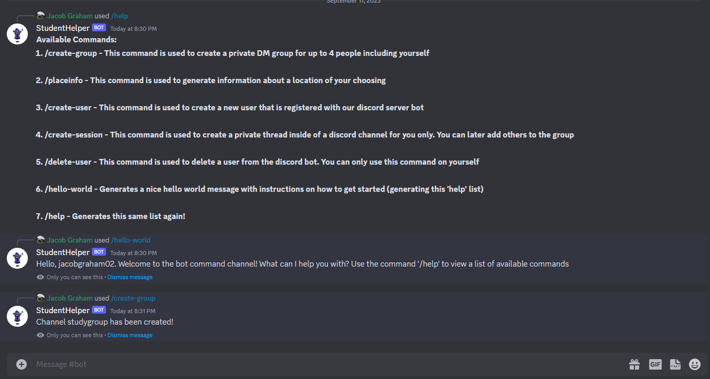

  <strong> The bot command used to create a study group within Discord </strong>

  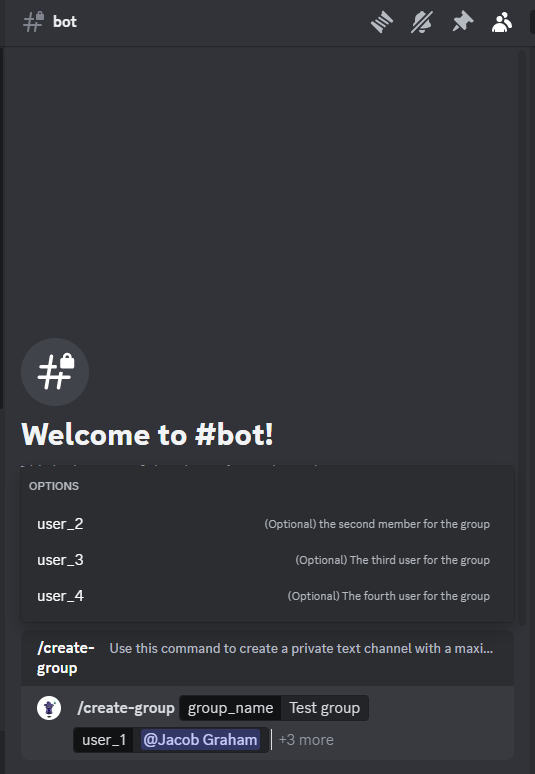

  <strong> The result of the create group bot command </strong>

  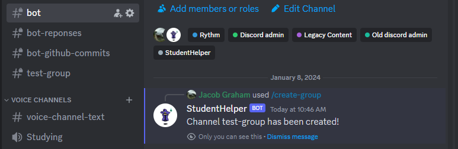

  <strong> Generating a server-wide message with all currently-existing classes displayed for students to see the classes for the day </strong>

  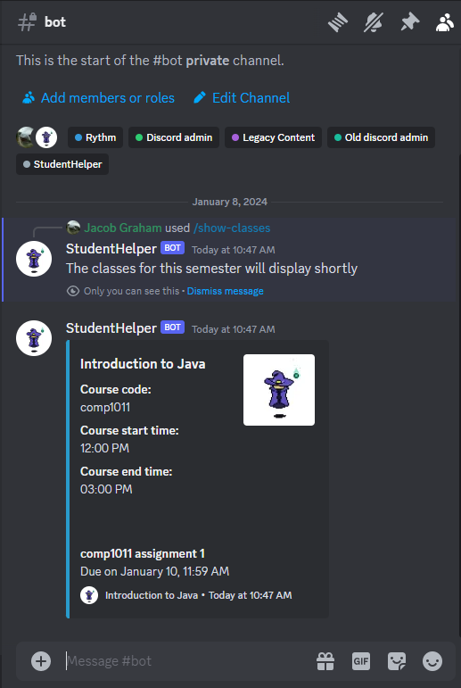

  <strong> A student is allowed to create a user that is registered with the bot </strong>
  
  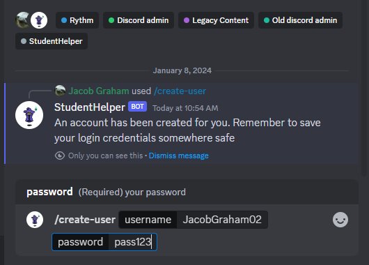

  <strong> The result in the MySQL database of a user being created </strong>

  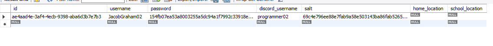

  <strong> A command that allows the creation fo a common class: a class that all students have in common </strong>

  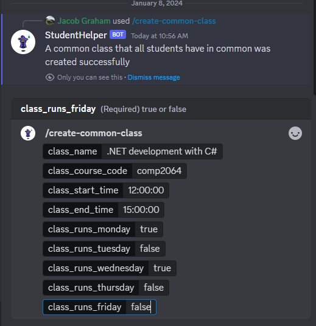

  <strong> The result in the MySQL database of the user common class being created </strong>

  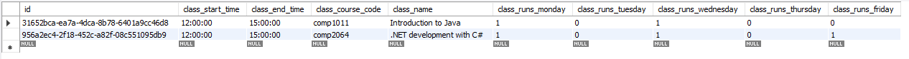

  <strong> An image showing the Discord channel which holds all of the activity on the bot GitHub repository </strong>

  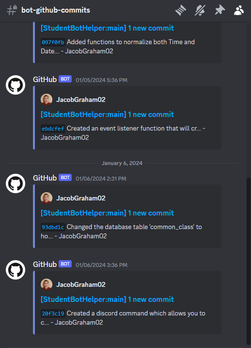

  <strong> An image showing all of the database operations performed by using the Discord bot </strong>

  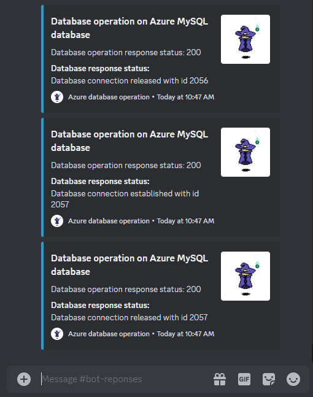

  <strong> An image showing the MySQL database structure that was created for the bot </strong>

  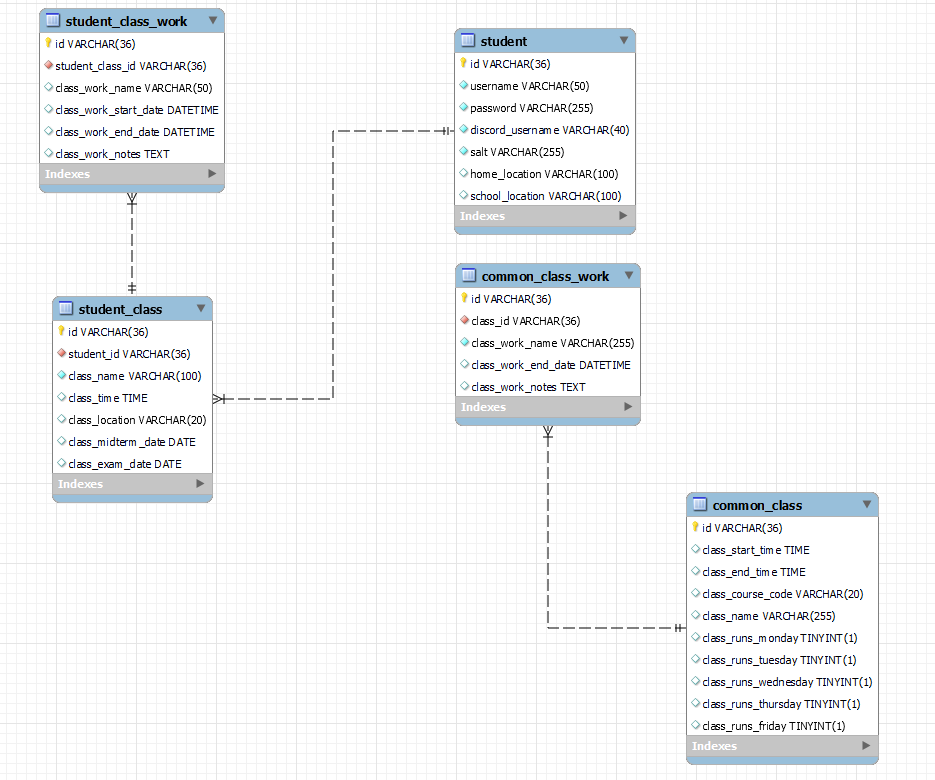
  </article>
  
(<a href="#readme-top">back to top</a>)

</section>

<section>
  <!-- The purpose of the project -->
  <h2 id="purpose-of-project">About The Project</h2>
  

  StudentBotHelper is a Discord bot primarily aimed at College and University students to act as both a tickler system and document repository, and to centralize onto one platform a lot of resources that students would find useful. In 2023 and 2024, a lot of students, incuding myself, use Discord for purposes ranging from gaming to school. Therefore, a Discord bot that is aimed at assisting specifically students will garner a lot of interest and be appreciated by the population of Discord users that are currently students. 
  

  

    The bot is continuously being developed and improved so as to keep on top of current trends in the software development industry, and to ensure compatiblity with the current version of MySQL, the Discord API, and with Microsoft Azure. Below is a summarized list of all the functions that the Student Bot Helper currently can do: 
    <ol>
      <li>Registering an account to use with the bot</li>
      <li>Creating a private 'thread' session with the bot. This simulates a real session that you would typically establish if you were using a web application</li>
      <li>Creating a private group dm with bot and up to 4 other users.</li>
      <li>Generating a google maps uri for information of a specific place (utilizes the google places api)</li>
      <li>Generating a google maps uri for directions from one place to another place (utilizes the google directions api)</li>
      <li>Deleting your user account (if the account is associated with your discord username)</li>
      <li>Typing the <strong>'/help'</strong> command to get more information about what commands can be used with the bot</li>
      <li>Having Discord events created automatically for classes in the present or future</li>
    </ol>
  

    
(<a href="#readme-top">back to top</a>)

</section>

<section>
  <h2 id="built-with">Built with</h2>
  

    <ol>
      <li><a href="https://www.typescriptlang.org/" >TypeScript</a></li>
      <li><a href="https://azure.microsoft.com/en-ca">Microsoft Azure</a></li>
      <li><a href="https://www.mysql.com/">MySQL</a></li>
      <li><a href="https://discord.js.org/">Discord.js</a></li>
      <li><a href="https://developers.google.com/maps/documentation/places/web-service/overview">Google Places API</a></li>
      <li><a href="https://developers.google.com/maps/documentation/directions/overview">Google Directions API</a></li>
      <li><a href="https://nodejs.org/en">Node.js</a></li>
    </ol>
  

  
(<a href="#readme-top">back to top</a>)

</section>

<section>
  <article>
    <h2 id="things-i-learned">Things I learned while building this project</h2>
    
While building this Discord bot, I learned how to write complex applications in TypeScript, further my skill in developing web applications using Node.js, while following proper SOLID and DRY software development principles. I built this entire application with a keen eye given towards creating loosely-coupled code that is easy to modify, easy to test, and can integrate well with third-party platforms such as Microsoft Azure. So far, I have created a loosely-coupled database repository class that uses SSH to securely connect with a MySQL database on Microsoft Azure. I learned how to write both unit tests so that I could verify my application functions perform properly, and integration tests with the Azure MySQL database so that I know my application can interact with the database correctly.

    
Additionally, I used optimal software development architecture to build this application, using the repository design pattern for the database, and utilizing entity classes to construct objects to use. I used Docker to make a Dockerfile that will allow any user to download the project and just build the constructed Docker image to quickly build their version of the project and get started immediately, without having any problems or potential roadblocks with their project.

    
I added many features to this project to make the bot as compatible as possible with similar real-life implementations of other Discord bots. Below are some of the things I considered when building this Discord bot project:
      <ol>
        <li>Used UUID data types instead of integer ID's for the database to allow for integration with other databases</li>
        <li>Used the repository design pattern to create loose coupling between the application layer and the data layer, allowing for flexibility in dealing with changes</li>
        <li>Wrote several utility classes containing functions that take input data and normalize the data to create objects which can be used with the Discord API</li>
      </ol>
  </article>
</section>

<section>
  <article>
    <h2 id="">Challenges that I faced while building this project</h2>
    
While building this Discord bot, the most prominant challenge that I faced was when debugging errors or thrown by the Discord API, as the Discord API throws very abstract and general error messages, which required me to sequentially go through the stack trace and thoroughly investigate every file which appeared in the stack trace in order to find which file was causing the problems. Any Discord API error which was thrown included an error code which I could search for on Google to assist me in finding which file could be causing the problems.

    
Another significant challenge that I faced while building this project was building the project to be as appliable to the real world as possible (using proper design patterns, following SOLID and DRY principles, and designing the application to be able to merge seamlessly with other similar applications). In my project, I had to create a custom Discord client in the folder <strong>utils/CustomDiscordClient</strong> that interacts with the Discord API because of the custom additions I added to my bot. 
  </article>
</section>

<section>
  <article>
    <h2 id="getting-started">Getting started</h2>
    
The following section gives you instructions on the prerequisites you need to set up StudentBotHelper locally on your own Discord server

  </article>

  <article>
    <h3 id="prerequisites">Prerequisites</h3>
    
First, you must have Node.js installed on your machine. You can download Node.js from <a href="https://nodejs.org/en">Here</a>

  </article>

  <article>
    <h4 id="if-on-windows">If on Windows</h4>
    
Click on the download button that says 'Recommended for Most Users' as the bottom text.

  </article>
    
  <article>
    <h4 id="if-on-macos">If on MacOS</h4>
    
Click on the Nodejs download link <a href="https://nodejs.org/en/download">here</a>. Once you are at the Nodejs downloads page, click on the download button which says 'macOS Installer'
  
  </article>

  <article>
    <h4 id="if-on-linux">If on Linux</h4>
    
Click on the Nodejs download link <a href="https://nodejs.org/en/download">here</a>. Once you are at the Nodejs downloads page, you have one of two options for installers:
    Linux 64-bit binaries: Click on the '64-bit' button to the right of the text 'Linux Binaries (x64)'
    Linux ARM binaries: Click on the 'ARMv7' or 'ARMv8' button to the right of the text
  </article>

  <article>  
    Once you have downloaded an installer, proceed with the installation of Node.js. You can check to see if your Nodejs installation was successful by opening the Windows command prompt, 
    MacOS terminal, or Linux terminal and typing the following command:
    

  </article>

  <article>
    
Once you have successfully installed Node.js on your system, type in the following command into your command prompt or terminal:

    npm install npm@latest -g
    
  </article>
  
  <article>
    <h2 id="installation">Installation<h2>
    TODO
  </article>
  
(<a href="#readme-top">back to top</a>)

</section>

<section>
  <article>
    

      <h2 id="usage">How to run the tests</h2>
      TODO 
    

  </article>
  
(<a href="#readme-top">back to top</a>)

</section>

<section>
  <article>
    <h2 id="contributing">Contributing</h2>
    Contributions are what make the open source community such an amazing place to learn, inspire, and create. Any contributions that you make are greatly appreciated.
  </article>
   
  <article>
    If you have a suggestion that would make this better, please fork this repository and create a pull request. You can also simply open an issue with the tag "enhancement".
  </article> 
   
  <article>
    Below are some example steps on how to create a pull request for this repository:
    <ol>
      <li>Fork the Project</li>
      <li>Create your Feature Branch (`git checkout -b feature/AmazingFeature`)</li>
      <li>Commit your Changes (`git commit -m 'Add some AmazingFeature'`)</li>
      <li>Push to the Branch (`git push origin feature/AmazingFeature`)</li>
      <li>Open a Pull Request</li>
    </ol>
  </article>
  
(<a href="#readme-top">back to top</a>)

</section>

<section>
  <article>
    <h2 id="contact">Contact me</h2>
    

      Jacob Graham - jakegraham54@gmail.com
    

  </article>
</section>

<section>
  <aside>
    
(<a href="#readme-top">back to top</a>)

  </aside>
</section>

